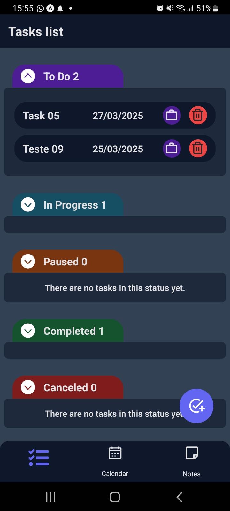
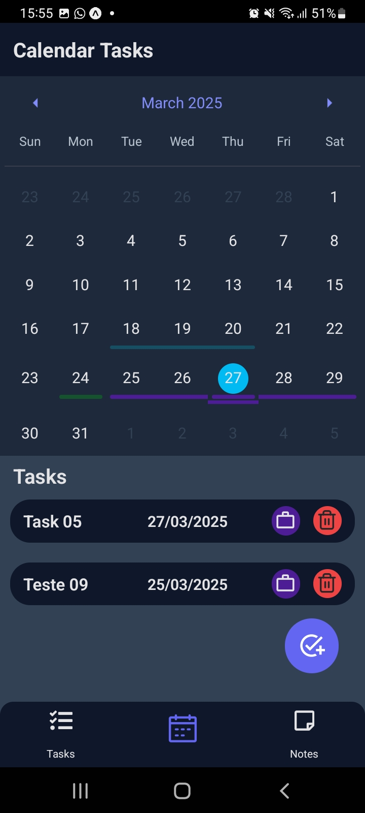
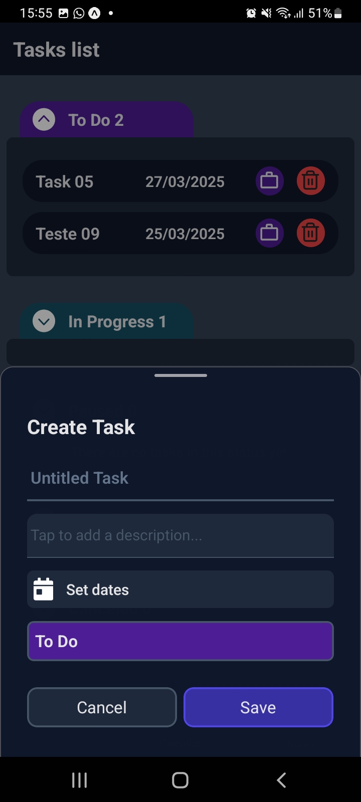
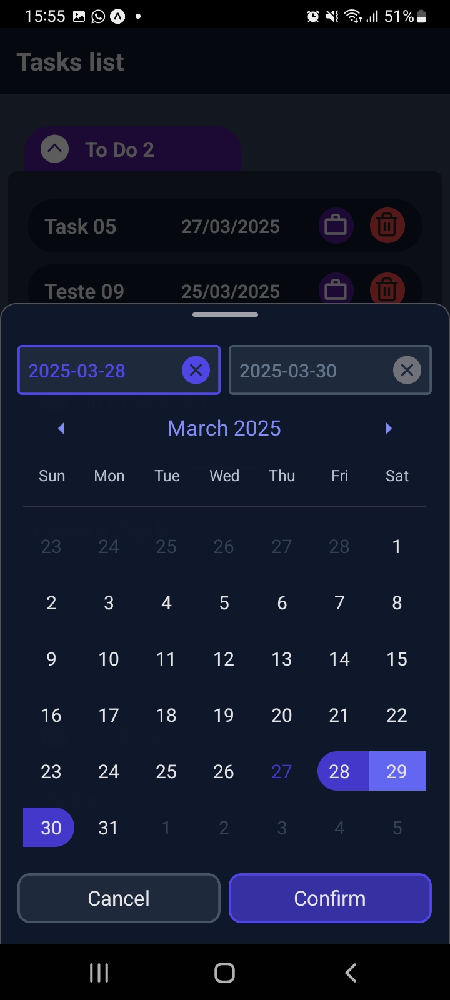
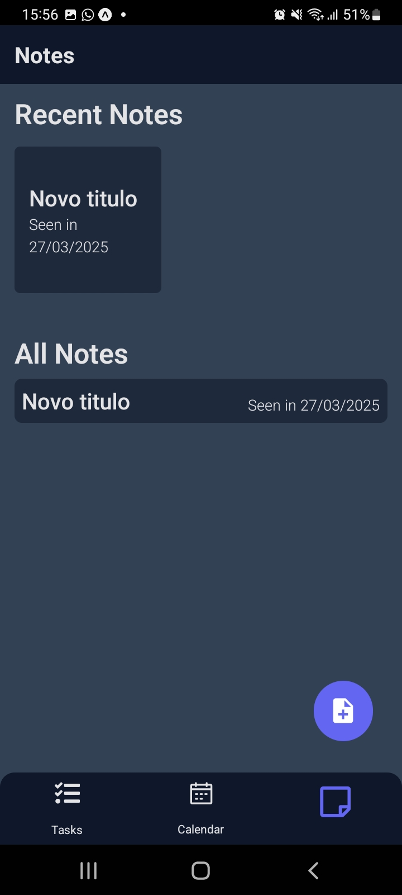
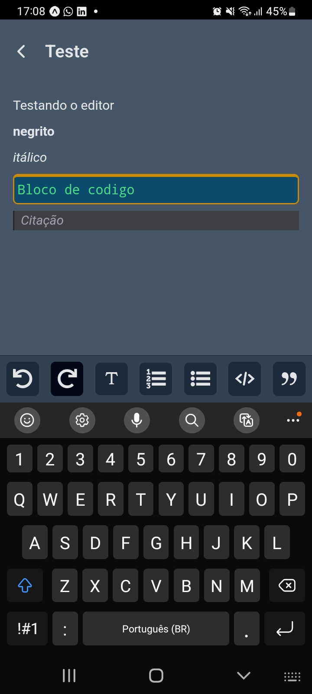

# Descrição

App desenvolvido com [Expo](https://expo.dev/) para criação de tarefas e notas.
Consite em um app simples apenas para vies de aprendizado, sendo meu primeiro app mobile.

## Telas

O app possui tres telas, sendo duas para as tarefas e uma para as notas.

### Lista de Tarefas

Esta tela mostra as tarefas organizadas comforme seus status

### Calendário de tarefas

Esta tela mostra um calendário com as marcações nos dias que posuuem arefas e logo abaixo a lista das tarefas do dia

### Edição de tarefas

 

Estas telas possuem o formulario de edição de tarefas, para adicionar uma nova tarfa basta apertar o icone no canto inferior direito, e caso precise editar uma tarefa ja criada basta apertar/ clicar em cima dela.

### Editor de notas

 

Aqui temos um editor RIchText para você criar e editar suas notas.

## Tecnologias

Para a base do app foi utilizado o [expo](https://expo.dev/) com o [react-native](https://reactnative.dev/) para salver em memória foi utilizado o SQLite juntamente com o [Drizzle ORM](https://orm.drizzle.team/), para as tarefas utilizei a biblioteca [react-native-calendars](https://wix.github.io/react-native-calendars/docs/Intro), e para o editor rich text foi utilizado o [lexical](https://lexical.dev/).
Ainda e minha primeira aplicação mobile, então provavelmente havera bugs e com certeza melhorias a serem feitas, mas pode se dizar que seria esta uma versão BETA.
Fique a vontade para olhar o código e utiliza-lo em seus estudos.
